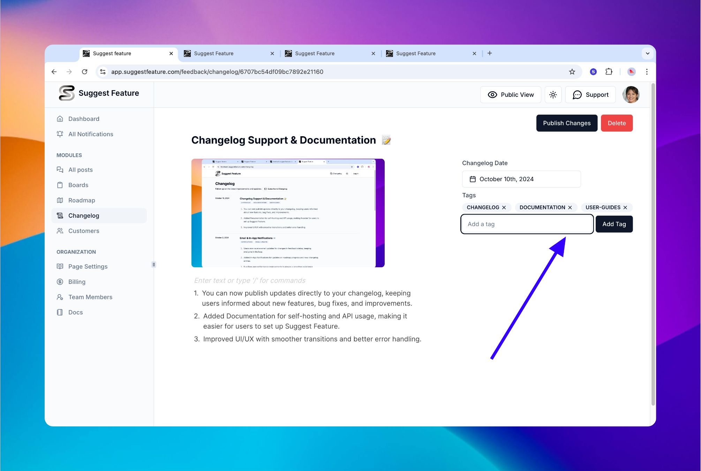

# Changelog



### What is changelog ?&#x20;

<figure><figcaption></figcaption></figure>

A streamlined way for your team to officially announce product updates and keep your users informed. With a unified page where all your release updates are neatly organized, your users can easily track your latest changes and stay engaged with your product roadmap! 📣

## Why Use the Changelog?

The Suggest Feature Changelog gives you a space to showcase all your product improvements, new features, and bug fixes in one place. This transparency helps maintain strong communication with your user base, building trust and engagement with every release.

With our Changelog, users have an overview of your product’s evolution, so they always know what’s new and what to expect. Whether it's a major feature launch or a small bug fix, your users will feel connected and informed.

## Creating a new Changelog Entry

<figure><figcaption></figcaption></figure>

Adding a new update to your Changelog is simple:

1. **Navigate to the Changelog Section** in your Suggest Feature admin panel.
2. **Click on "Add changelog"** and fill out the necessary details like the title, description, and the nature of the update. And also add the cover image if applicable
3. **Link related posts**: If you’ve had discussions or feature requests related to this update, you can easily link those posts, offering users additional context. When users visit the related post, they’ll be directed to the detailed changelog entry for more information.

## Categorize with Labels/Tags

<figure><figcaption></figcaption></figure>

To make your Changelog even more organized, **use tags**! Labels allow you to categorize your updates, making it easier for users to filter updates by type whether it's a bug fix, feature update, or performance improvement. This makes navigating your product updates simple and clear for your users.

## Email Notifications for Updates

<figure><figcaption></figcaption></figure>

Users can subscribe to get email notifications whenever a new changelog entry is published. Keeping your users in the loop has never been easier. Every time you post an update, your subscribers will be notified right away, driving higher engagement and awareness for your product.

## Stay Connected with Your Users

With Suggest Feature's **Changelog**, users can:

* See every update in a single, unified place.
* Filter updates by category using labels/tags.
* Subscribe to email notifications and never miss an important release.

Transparency is key to building a loyal community around your product. With the changelog feature, you can ensure your users feel included in your journey as your product evolves.

## **Try it now**

Check out a live example of our Changelog [here](https://feedback.suggestfeature.com/changelog)
