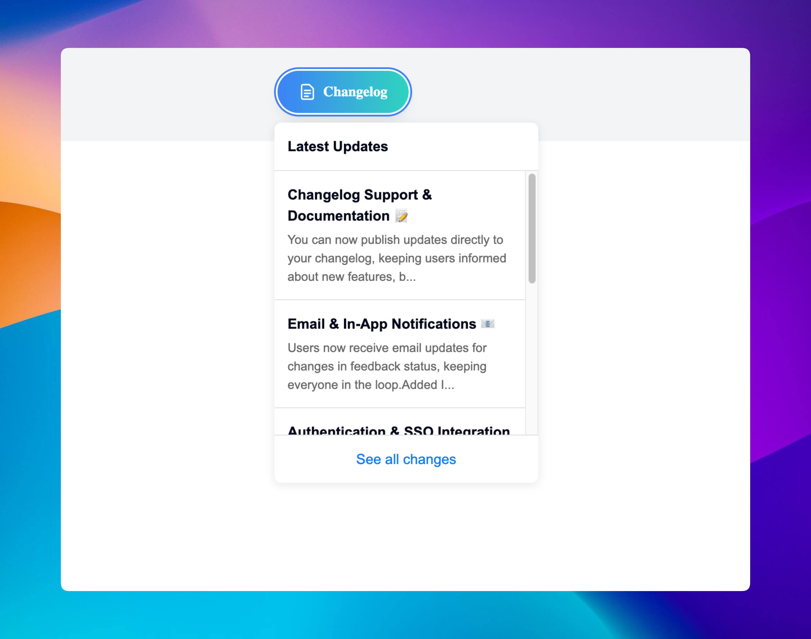

# Changelog Widget

<figure><figcaption></figcaption></figure>

The Suggest Feature changelog widget allows you to embed a changelog directly into your website, making it easy for users to stay updated on the latest features and changes. The widget attaches to a button, and when clicked, it displays the changelog in a modal.

### 1. Install the Changelog Widget

First, include the Suggest Feature SDK by adding the following script inside the `<head>` or `<body>` tags of your HTML:

```html
<script src="https://suggestfeature.com/js/changelog.js" async></script>
```

This will load the required functionality to initialize and control the changelog widget.

### 2. Attach the Changelog to a Button

To trigger the changelog modal, attach it to a button using the `data-sf-changelog` attribute. Here's an example:

```html
<button data-sf-changelog>View Changelog</button>
```

Once initialized, clicking this button will open the changelog.

### 3. Initialize the Changelog

Next, you need to initialize the changelog widget. You can do this by using the `SuggestFeature.init()` method, which takes several options to configure how the widget behaves.

```javascript
SuggestFeature.init({
  domain: 'https://feedback.suggestfeature.com',
  position: 'bottom', // options: 'top', 'bottom' (default)
  align: 'left', // options: 'left' (default), 'right'
  theme: 'light' // options: 'light' (default), 'dark'
});
```

#### Options:

* **domain**: The domain where your feedback portal is hosted.
* **position**: Sets the vertical position of the changelog (either `top` or `bottom`).
* **align**: Sets the alignment of the changelog (`left` or `right`).
* **theme**: Controls the appearance of the changelog (`light` or `dark` theme).

### 4. Unread Changelog Notifications

When there are unread changelogs, a notification dot will automatically appear on the button with the `data-sf-changelog` attribute. This ensures users are notified when new updates are available.

***

### Nextjs Example

```jsx
"use client"
import { useEffect } from "react";

export default function Home() {
  useEffect(() => {
    SuggestFeature.init({
      domain: 'https://feedback.suggestfeature.com',
      position: 'bottom',
      align: 'left',
      theme: 'light' // options: light (default), dark
    });
  }, []);

  return (
    <div>
      <script src="https://suggestfeature.com/js/changelog.js" async></script>
      <button data-sf-changelog>Changelog</button>
    </div>
  );
}
```

#### Additional Notes

* You can customize the behavior of the changelog widget further by integrating it into your frontend components.
* The changelog can be embedded in any framework or library that supports HTML and JavaScript.
